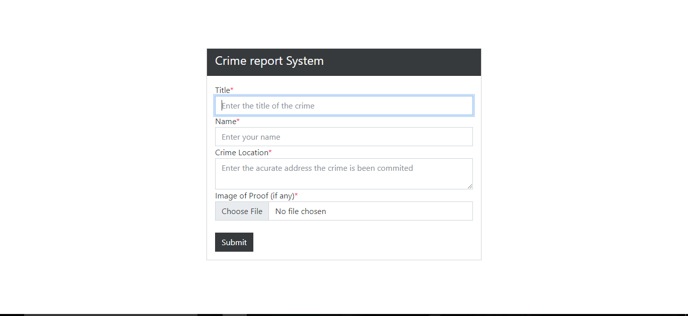

# Crime Report System Website With  React

<div align="center">



</div>

## Clone the repository using the command below :

```bash
git clone https://github.com/patoski716/crime-reporting-system-React.git

```

## Move into the directory where we have the project files : 

```bash
cd crime-reporting-system-React

```

## Project setup
```
npm install
```

### Compiles and hot-reloads for development
```
npm start
```

### Compiles and minifies for production
```
npm run build
```
